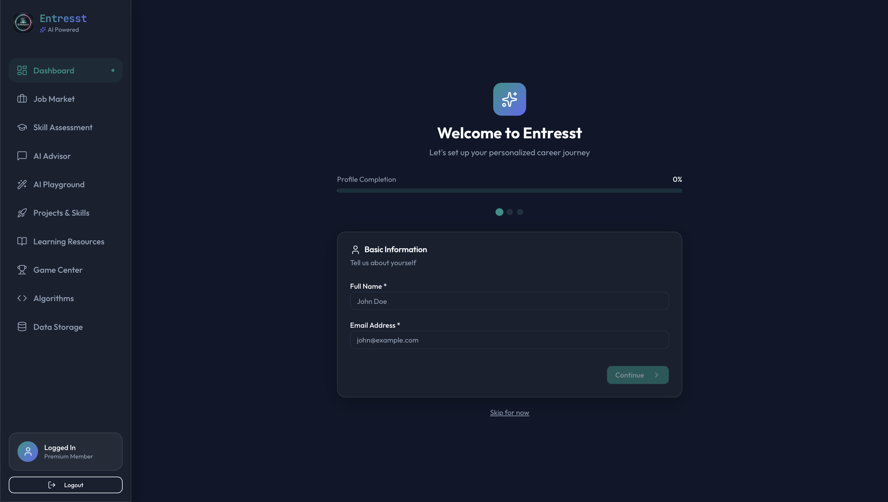
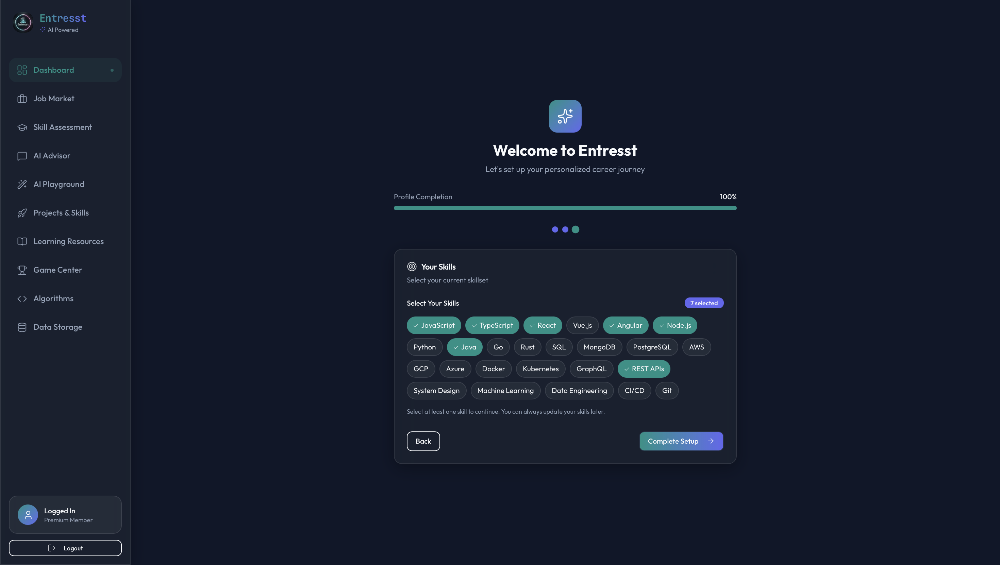
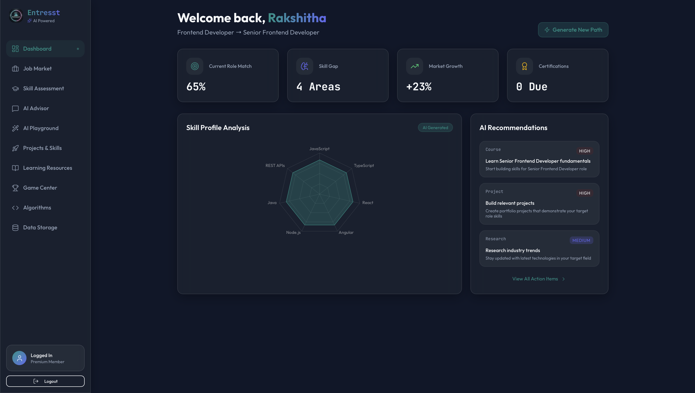
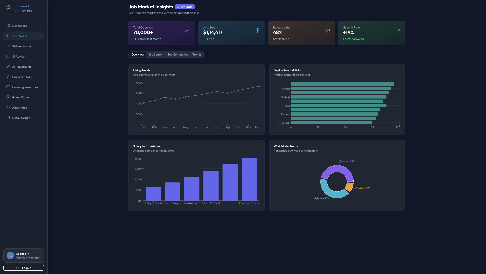
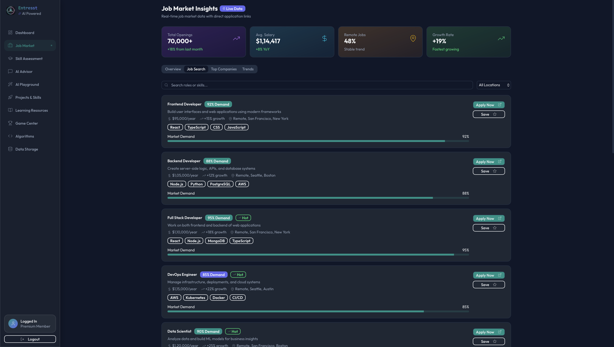
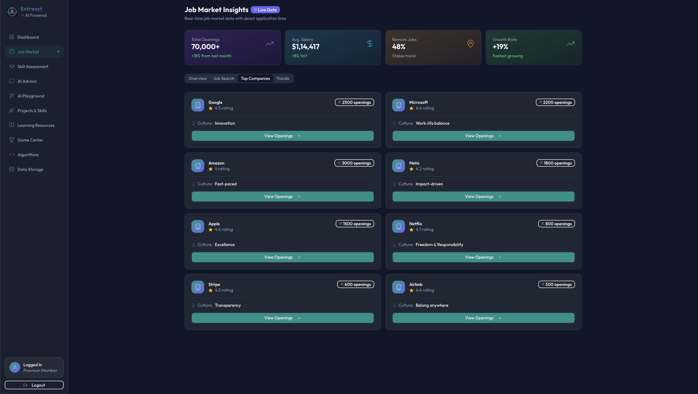
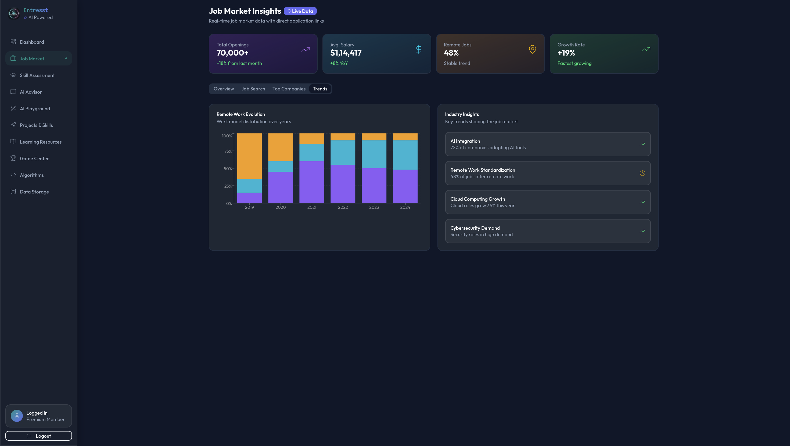
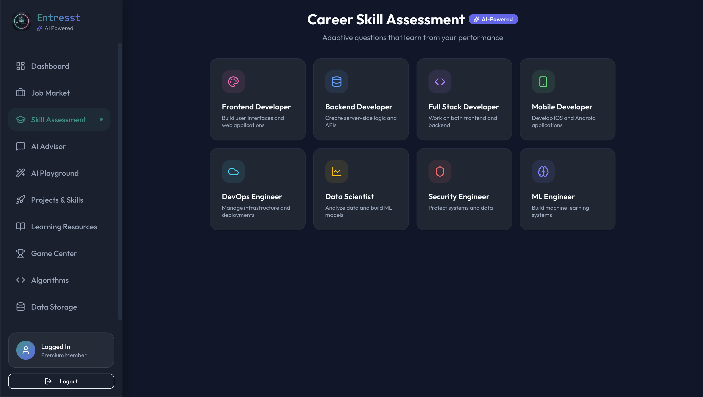
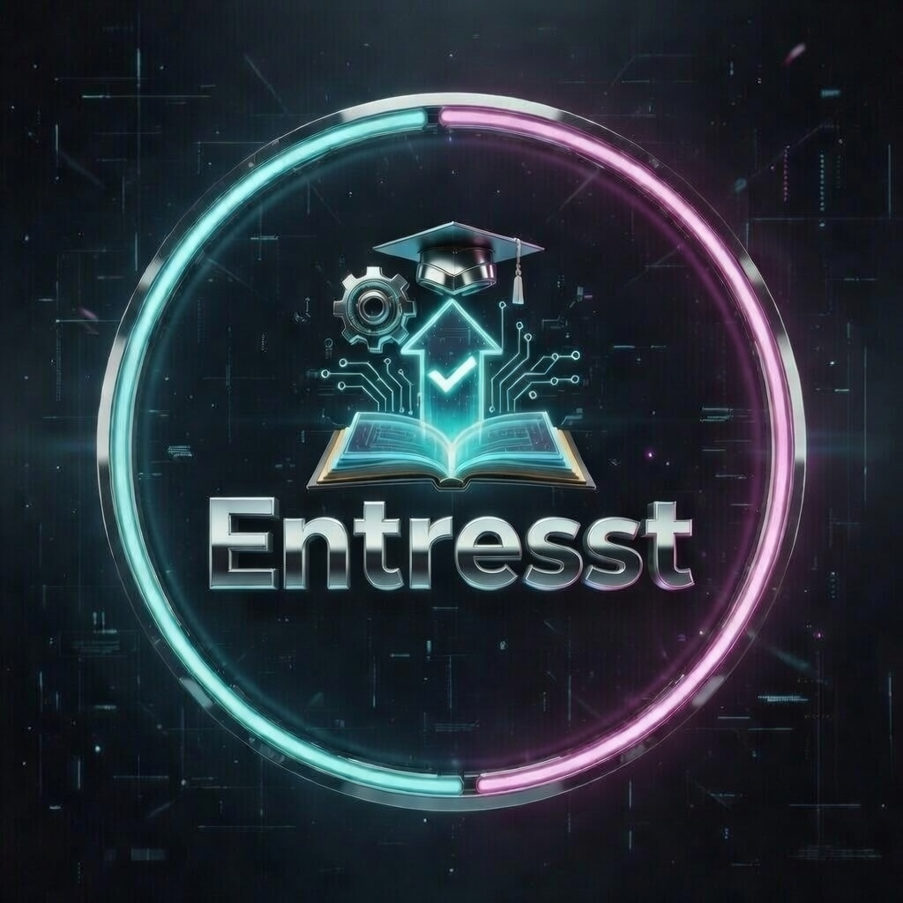

# Entresst-AI

[](https://github.com/srakshitha0802/Entresst-AI-/graphs/contributors)
[](https://github.com/srakshitha0802/Entresst-AI-/commits/main)
[](LICENSE)
[](https://react.dev)
[](https://www.typescriptlang.org)

**Lead Developer:** srakshitha0802  
**Contributors:** lakshmijahnavik, SaiPriyamshu, sirishapyadav16

A comprehensive full-stack AI-powered career development platform that helps users track their skills, prepare for interviews, explore job opportunities, and accelerate their career growth.


---

## 🎯 Overview

Entresst-AI is an all-in-one career development platform that combines AI-powered tools to help professionals and students accelerate their career growth. From interview preparation to skill tracking, Entresst provides personalized guidance powered by cutting-edge AI technologies including Google Gemini, OpenAI, and HuggingFace.

---

## ✨ Key Features

### 🖥️ Dashboard
User Profile Overview with personalized information, Skills Radar Chart visualization, Statistics Cards (role match percentage, skill gaps, market growth, certifications due), AI Recommendations, and Quick Actions navigation.



### 📝 AI-Powered Quiz
Dynamic Question Generation with AI, Adaptive Difficulty, Category Selection (Technical, Behavioral, System Design), Real-time Feedback, Progress Tracking, and Performance Analytics.



### 💼 Job Market Insights
Real-time Job Data, Demand Analysis with growth percentages, Salary Information, Company Listings with ratings, Work Model Trends (remote/hybrid/on-site), and AI-Powered Recommendations.



### 📄 Resume Analyzer
AI Resume Review, ATS Scoring, Keyword Optimization, and Format Analysis for optimal job applications.



### 🤖 AI Playground
Text Generation using Gemini, OpenAI, and HuggingFace, Image Generation from text prompts, Model Comparison, and Code Analysis for improvements.



### 📚 Learning Resources
Curated Resources organized by topic, AI Recommendations for personalized learning, and Progress Tracking for your learning journey.



### 🎮 Game Center
XP & Levels system, Achievement Badges, Streak Tracking, Leaderboard competition, and Boss Battles for challenging problems.



### 🛠️ Projects & Skills
AI-generated Project Ideas based on your skills, Visual Skill Tree, Milestone Tracking, and Project Generator for personalized mini-projects.



---

## 🚀 Additional Features

### 🎤 Mock Interview
AI-Generated Questions for practice, Technical & Behavioral questions, Answer Evaluation with AI feedback, Difficulty Levels (Easy/Medium/Hard), and Performance Tracking.

### 📖 Algorithm Learning
Detailed Algorithm Explanations, Complexity Analysis (Time & Space), Code Examples in multiple languages, and AI-Powered Tutoring.

### 💬 Advising Session
AI Career Advisor for chat-based counseling, Personalized Guidance, Career Path Planning, and Skill Gap Analysis.

### ⚙️ Profile Setup
Complete Onboarding Flow, Skills Assessment with proficiency levels (1-100), Career Goals definition, and Profile Persistence.

---

## 🛠️ Tech Stack

### Frontend
| Technology | Purpose |
|------------|---------|
| **React 19** | UI framework |
| **TypeScript 5.6** | Type safety |
| **Vite** | Build tool |
| **Tailwind CSS** | Styling |
| **Radix UI** | Component primitives |
| **Framer Motion** | Animations |
| **Recharts** | Data visualization |
| **Wouter** | Routing |
| **TanStack Query** | Data fetching |

### Backend
| Technology | Purpose |
|------------|---------|
| **Express** | Web framework |
| **TypeScript** | Type safety |
| **Node.js** | Runtime |

### AI/ML Services
| Service | Capabilities |
|---------|-------------|
| **Google Gemini** | Text and image generation |
| **OpenAI** | GPT models |
| **HuggingFace** | Open source models |

### Storage (Multiple Options)
- **MongoDB** - Primary database (when configured)
- **Supabase** - PostgreSQL + Storage (when configured)
- **Firebase** - Firestore + Storage (when configured)
- **In-Memory** - Fallback storage

---

## 📦 Installation

### Prerequisites
- Node.js 18+
- npm or yarn

### Quick Start

```bash
# Clone the repository
git clone https://github.com/srakshitha0802/Entresst-AI-.git
cd Entresst-AI-

# Install dependencies
npm install

# Run development server
npm run dev
```

### Environment Configuration (Optional)

Create a `.env` file with any of these variables:

```bash
# Server
PORT=5173

# Storage (optional)
SUPABASE_URL=your_supabase_url
SUPABASE_ANON_KEY=your_supabase_key
MONGODB_URI=your_mongodb_uri

# AI Services (optional)
GEMINI_API_KEY=your_gemini_key
OPENAI_API_KEY=your_openai_key
HUGGINGFACE_API_KEY=your_huggingface_key
```

### Access

```
Local: http://localhost:5173
Network: http://YOUR_IP_ADDRESS:5173
```

---

## 🖥️ Available Scripts

| Command | Description |
|---------|-------------|
| `npm run dev` | Start development server |
| `npm run build` | Build for production |
| `npm run start` | Start production server |
| `npm run check` | Run TypeScript checks |

---

## 📁 Project Structure

```
Entresst-AI/
├── client/                    # React frontend
│   ├── src/
│   │   ├── components/       # Reusable UI components
│   │   │   ├── layout/       # Layout components (Sidebar)
│   │   │   └── ui/           # UI component library (40+ components)
│   │   ├── pages/           # Page components (13+ pages)
│   │   ├── hooks/           # Custom React hooks
│   │   ├── lib/             # Utilities
│   │   ├── App.tsx          # Main app component
│   │   └── main.tsx         # Entry point
│   └── index.html           # HTML template
├── server/                   # Express backend
│   ├── services/
│   │   ├── ai.ts            # AI service integrations
│   │   ├── mongodb.ts      # MongoDB service
│   │   └── storage.ts       # Storage abstraction
│   ├── routes.ts            # API routes
│   └── index.ts             # Server entry point
├── script/                   # Build scripts
├── shared/                   # Shared types
├── screenshots/             # App screenshots
├── package.json              # Dependencies
└── vite.config.ts            # Vite configuration
```

---

## 🔌 API Endpoints

### AI Endpoints
- `POST /api/ai/generate` - Generate text with specific AI provider
- `POST /api/ai/compare` - Compare AI provider responses
- `POST /api/ai/generate-image` - Generate images
- `POST /api/ai/quiz-question` - Generate quiz questions
- `POST /api/ai/job-insights` - Get job market insights
- `POST /api/ai/code-analysis` - Analyze code
- `POST /api/ai/algorithm-explain` - Explain algorithms
- `POST /api/ai/interview-prep` - Generate interview prep

### User Endpoints
- `GET /api/user/profile` - Get user profile
- `POST /api/user/profile` - Update profile
- `POST /api/user/profile-setup` - Complete onboarding

### Game Endpoints
- `GET /api/game/stats` - Get user game stats
- `POST /api/game/submit-answer` - Submit quiz answer
- `GET /api/game/leaderboard` - Get leaderboard

---

## 🎮 Game Mechanics

### Earning XP
- Answer correctly: 50 XP base
- Hard difficulty: +30 XP
- Medium difficulty: +15 XP
- No hints used: +20 XP
- Fast answer (<30s): +15 XP

### Leveling Up
- Level formula: `Level = floor(sqrt(XP / 100)) + 1`

### Badges
- `first_wins` - Answer 10 questions correctly
- `streak_5` - Get 5 correct in a row
- `master_[topic]` - Achieve 80% mastery in a topic

---

## 🤝 Contributing

Contributions are welcome! Please follow these steps:

1. Fork the repository
2. Create your feature branch (`git checkout -b feature/amazing-feature`)
3. Commit your changes (`git commit -m 'Add some amazing feature'`)
4. Push to the branch (`git push origin feature/amazing-feature`)
5. Open a Pull Request

---

## 📄 License

MIT License - feel free to use this project for any purpose.

---

## 👥 Team

### Core Contributors
- **srakshitha0802** - Lead Developer
- **lakshmijahnavik** - Contributor
- **SaiPriyamshu** - Collaborator
- **sirishapyadav16** - Collaborator

---

Built with ❤️ for career development and learning.



